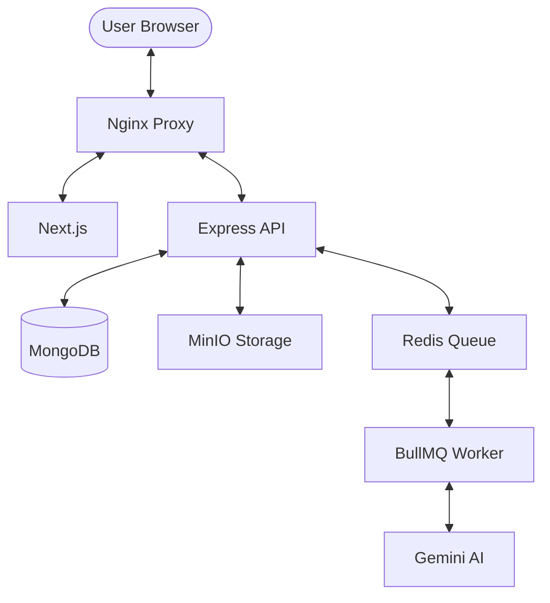

# 🎬 ClipSphere

**ClipSphere** is a premium, high-performance video social platform designed for creators and viewers. It features AI-powered recommendations, seamless video streaming, and a robust micro-tipping economy.

---

## ✨ Key Features

- 🎥 **Video Management**: Seamless MP4/HLS streaming with high-quality playback.
- 🧠 **AI Recommendations**: Semantic search and content discovery powered by **Google Gemini AI** and **MongoDB Vector Search**.
- 💸 **Monetization**: Direct creator support through a secure **Stripe-integrated** tipping system.
- 🔔 **Real-time Social**: Instant notifications, likes, follows, and engagement tracking.
- 🛠️ **Developer Experience**: Fully containerized environment with Docker for easy deployment.

---

## 🛠️ Tech Stack

- **Frontend**: Next.js 15 (App Router), TypeScript, Tailwind CSS, Lucide Icons.
- **Backend**: Node.js, Express.js, BullMQ (Async processing).
- **Database**: MongoDB (Primary & Vector Store), Redis (Job Queue & Cache).
- **Storage**: MinIO (S3-Compatible Object Storage).
- **AI/ML**: Google Gemini (Vertex AI) for Vector Embeddings.
- **DevOps**: Nginx, Docker Compose.

---

## 🏗️ Architecture

ClipSphere follows a modern microservices-lite architecture:



---

## 🚀 Quick Start

### Prerequisites
- Docker & Docker Compose
- Bun (optional, for local development)

### Running with Docker
1. Clone the repository.
2. Create a `.env` file in the root (refer to `server/.env` for required keys).
3. Run the following command:
   ```bash
   docker compose up --build
   ```
4. Access the app at `https://clipsphere.8bitsolutions.net` (or your local host configuration).

---

## 📚 Documentation

Detailed guides and project specifications:

- 🎨 **Design**: [Figma Project](https://www.figma.com/make/4SWfLI2rymjFyUgWmJORTd/Design-ClipSphere-Social-Platform?t=TUfb2ks474qU2JlW-1)
- 🗺️ **Roadmap**: [Project Plan](Docs/Plan.md)
- 📋 **Specs**: [Functional Requirements](Docs/Requirements.md)
- 🤝 **Contributing**: [Contribution Guidelines](Docs/Contribution.md)

---
*Created with sleepless nights and a lot of coffee by very tired developers :)*
